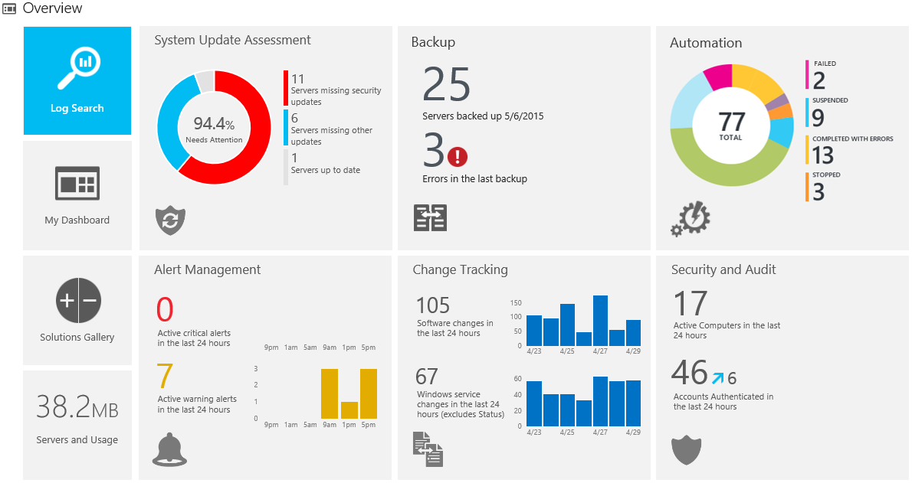
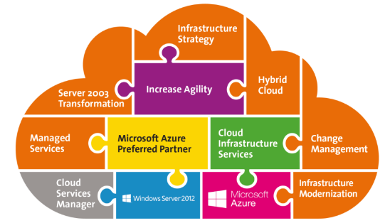
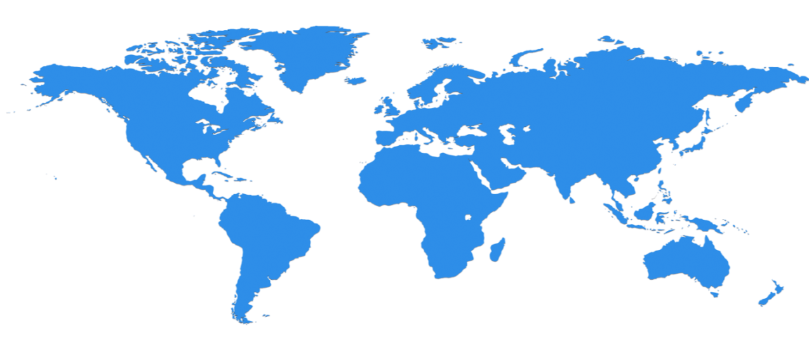
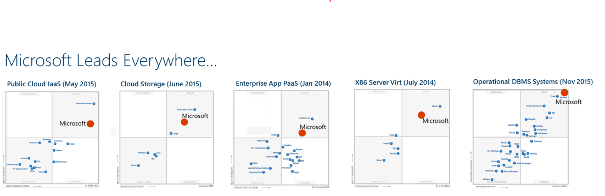
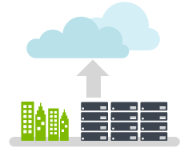
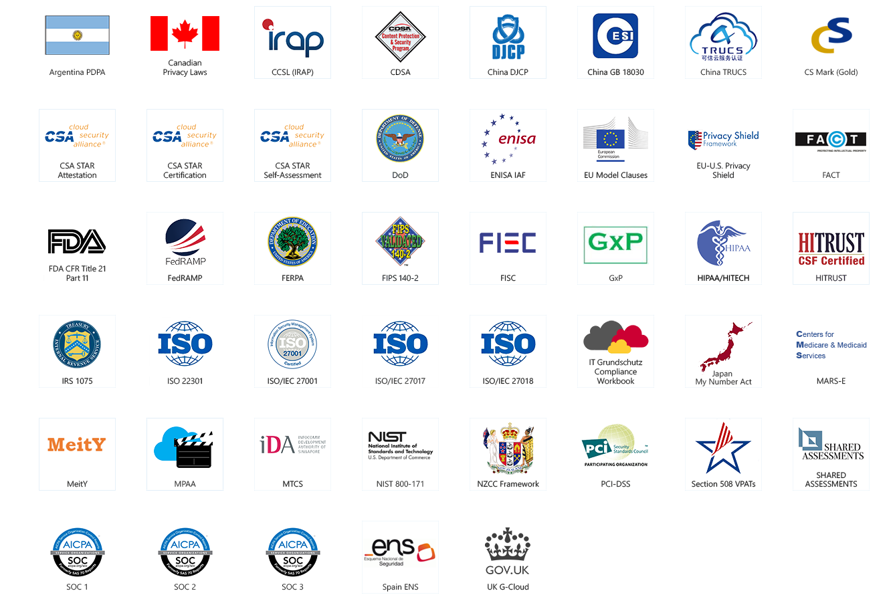
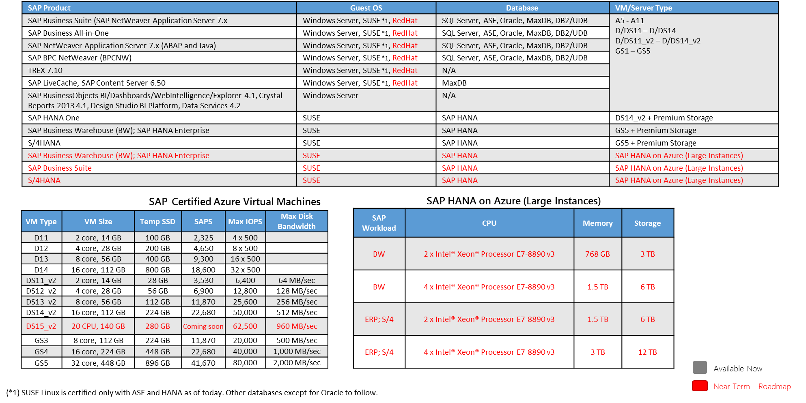
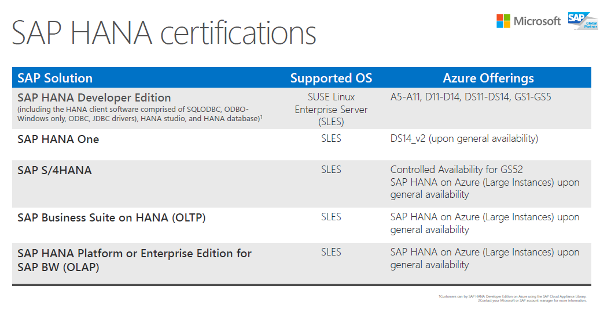
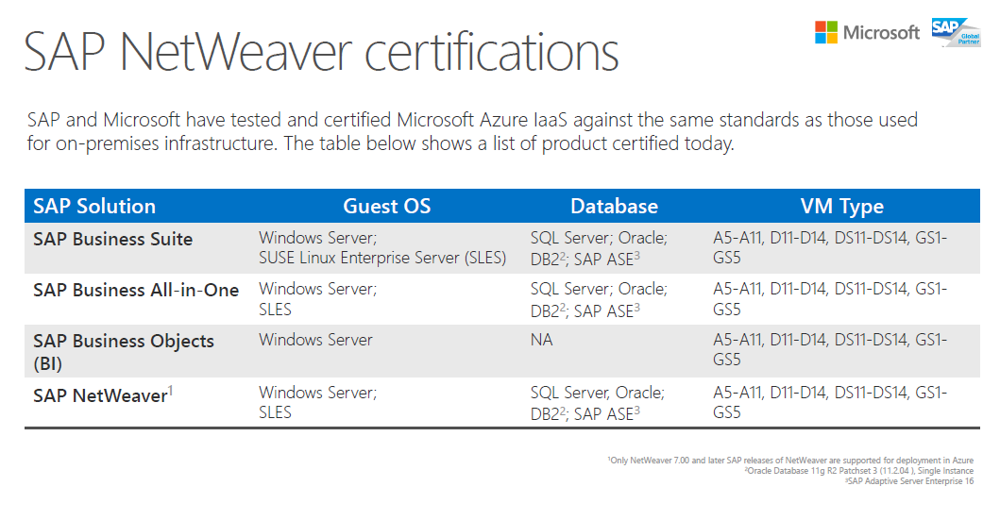

## Proposta  de  Implantação ,  Serviços   Gerenciados   e  Hospedagem {#slide-1}

## Termo de confidencialidade {#slide-2}

O conteúdo deste documento inclui nossa abordagem e material confidencial de propriedade da Avanade do Brasil Ltda. ("Avanade"), devendo ser usado exclusivamente para avaliar a nossa capacitação técnica para a prestação de serviços à TOTAL Combustíveis no âmbito do serviço denominado " Cloud   Managed  Services" (CMS) e Microsoft  Cloud  - Azure  Hosting  (Azure). 

Este material é estritamente confidencial e não poderá ser acessado por pessoas, dentro ou fora da TOTAL, que não estejam diretamente ligadas ao processo de avaliação ou ser utilizado para outros fins que não a própria avaliação.

Sob nenhuma hipótese, outra empresa que não a TOTAL, pode ter acesso a estes materiais sem a autorização explícita da Avanade.

Esta estimativa faz referência a nomes, marcas e logos que podem ser detidas por terceiros. O uso de tais marcas comerciais aqui não é uma afirmação de propriedade de tais marcas pela Avanade e não se destina a representar ou sugerir a existência de uma associação entre a Avanade e os legítimos proprietários de tais marcas comerciais.

Ao final do processo de avaliação, e caso esta abordagem não seja aceita pela TOTAL, ela deverá ser retornada a Avanade ou ser destruída.

## Sobre Avanade {#slide-3}

Avanade tem mais de 28.000 profissionais alocados em mais de 20 países. A Avanade foi fundada em 2000 como joint venture entre a Accenture e a Microsoft Corporation. Nossos serviços ajudam os clientes a melhorar o desempenho, a produtividade e as vendas em todas as categorias da indústria, e capacitar aqueles em que mais precisa: Os Colaboradores.

Nós trabalhamos em conjunto com o cliente para gerar valor ao negócio. E é assim que construímos a inovação: descomplicando tarefas, tornando o dia a dia de nossos clientes mais dinâmico, produtivo e inteligente.

Avanade é uma consultoria global de soluções de tecnologia especializada em plataforma Microsoft. Usamos nosso amplo conhecimento da indústria para buscar e entregar respostas inovadoras para os negócios.

## Nosso Entendimento -- Solução Proposta {#slide-4}

Solução Proposta

Provisionar uma infraestrutura que proporcione  elasticidade, sazonalidade e escala  para o novo  ERP, sistema de gestão fiscal e tributária e folha de pagamento;

Implementar  o  ambiente   descrito   em   uma   infraestrutura   disponível  e com SLA de  atendimento  que  suporte   às   necessidades  da TOTAL estabelecidas  nesta   proposta ;

Prover  meio  de  acesso   seguro   aos   usuários  da TOTAL;

Gerenciar  e  administrar  o  ambiente   pró   ativamente  e de forma a  seguir  as  práticas  de  segurança

Benefícios esperados

Cloud Managed Services

Conforme informado, a TOTAL , está em busca contínua por um modelo de crescimento sustentável e direcionado por sua visão de se tornar a quinta maior distribuidora de combustíveis líquidos do Brasil.

Neste contexto, a TOTAL pretende realizar a reestruturação do seu Centro de Serviços Compartilhados (CSC) e de migrar a plataforma de Gestão (ERP) para o ambiente SAP em uma Infraestrutura que suporte aumento e redução de escala, redução do Time- to -Market e garantia de SLA.

A  seguir descreveremos um pouco do nosso entendimento de como a Avanade pode suportar nesse desafio:

Suporte técnico  e  consultivo especializado  para  implantação  de  novos  workloads;

Gestão  e  transformação  do  modelo   operacional  de TI  como   serviço ;

Experiência e melhores práticas locais e globais;

DNA de consultoria da Avanade contendo grande conhecimento de mercado;

Serviço de nuvem confiável, segura e certificada;

Infraestrutura   homologada  e  certificada  para Linux e SAP;

Alta  disponibilidade ,  previsão   orçamentaria  e  pagamento  sob  consumo ; 

Infraestrutura que provê elasticidade, escala e  suporte à sazonalidade;

## Arquitetura da  Solução Desenho  de  Infraestrutura {#slide-5}

Abaixo está ilustrado o desenho de arquitetura previsto para implantação da infraestrutura. Os componentes de arquitetura da solução no Azure serão formalmente reavaliados na fase de implantação das soluções.

- Ambiente hospedado no datacenter do Azure dos EUA com a menor latência
- Conexão VPN Alta Performance ativa-ativa com Throughtput de até 200Mbps e até 30 túneis IPSEC (Route Based);
- Todos os servidores com redundância de discos (com 3 cópias);
- Servidores críticos com backup diário e retenção com limite de até 30 TB;
- Disponibilidade de 99,9% de infraestrutura e de máquinas com discos SSD descontado as manutenções programadas;
- Proteção de firewall entre todas as camadas da aplicação e ambientes;
- Automação  para  ligamento  e  desligamento  de parte do  ambiente   em   horários  de  quantidade   reduzida  de  consumo ;
- Monitoração  do  ambiente   através  do OMS;
- O tráfego de rede estimado para 340 usuários utilizando a solução desenhada na proposta técnica Accenture é de 30Mbps para as interfaces de usuário com SAP. Para esse cálculo foi considerado um percentual de concorrência de tráfego entre 10% e 25%;

Características da Solução

## Requisitos   técnicos Infraestrutura   dimensionada  --  Ambiente   Produção {#slide-6}

   Qtde   VM      Especificação VM        Ambiente   Descrição do  Servidor                                             Datacenter   Sistema   Operacional                              Disco  Local (GB)   Discos Bkp (GB) GRS   Discos  SSD (GB)
  ------- ------- ----------------------- ---------- ------------------------------------------------------------------ ------------ -------------------------------------------------- ------------------- --------------------- ------------------
  1       D3_v2   4 vCore / 14 GB RAM     PRD        SAP SOLMAN, SAP ROUTER (Linux com Sybase)                          US           SUSE Linux  Enterprise   Edition  12 SP2 for SAP                                             
                                                     STORAGE SSD para SAP APP PROD - 256 GB                             US                                                                                  1280                  512
  1       G5      32 vCore / 448 GB RAM   PRD        SAP ERP DB HA + SAP ERP APP NLB - S4+HANA                          US           SUSE Linux  Enterprise   Edition  12 SP2 for SAP                                             
                                                     SAP HANA - File System Data (3x RAM)                               US                                                                                  6720                  1536
                                                     SAP HANA -  Log (1x RAM)                                           US                                                                                  2240                  512
                                                     SAP HANA -  Shared (1x RAM)                                        US                                                                                  2240                  512
                                                     SAP HANA -  USR SAP e diretório root \\ (binários do HANA)         US                                                                                  2240                  128
                                                     STORAGE SSD para SAP APP PROD - 256 GB                             US                                                                                  1280                  256
  1       A5      2 vCore / 14 GB RAM     PRD        Servidor App MASTERSAF DW  + Servidor integrador  OneSource  ECF   US           Windows Server                                     150                 750                   
  1       F2      2 vCore / 4 GB RAM      PRD        Conector MASTERSAF DFE  (DFE DB e App na nuvem)                    US           SUSE Linux  Enterprise   Edition  12 SP2           50                  250                   
  1       F8      8 vCore / 16 GB RAM     PRD        Servidor DB MASTERSAF DW+ Banco de dados One Source                US                                                              300                 1500                  
  1       F8      8 vCore / 16 GB RAM     PRD        Servidor One Source                                                US                                                              100                 500                   
  1       D2_v2   2 vCore / 7 GB RAM      PRD        Sistema LG - FPW                                                   US           Window s Server + SQL  Std                         100                 500                   
  1       D2_v2   2 vCore / 7 GB RAM      PRD        Sistema LG - FPW  - Web Service                                    US           Window s Server                                    120                 600                   
  1       D2_v2   2 vCore / 7 GB RAM      PRD        Active Directory                                                   US           Windows Server                                     120                 600                   

Considerações:

- Será provisionado um dispositivo VPN dinâmico que suporta taxa de transferência com  throughtput  de até 200Mbps e até 30 túneis IPSEC ( Route   Based ).  Caso a TOTAL necessitar de mais de uma conexão com  rota estática ( Policy   Based ) novos dispositivos deverão ser contratados
- A previsão transações de  Storage  para o ambiente de produção  e  Dev  & QA é de 4088/ mês
- O estimado volume de dados de saída do datacenter é de 320 GB / mês
- O licenciamento de Sistema Operacional, aplicações e  banco de dados deverá ser fornecido pela TOTAL

A  especificação técnica foi baseada no sizing dos equipamentos fornecidos pelos fabricantes dos softwares e disponibilizados publicamente em seus respectivos sites, e  utilizado como referência para a implantação do ambiente da TOTAL, conforme descrito abaixo:

## Requisitos técnicos Infraestrutura dimensionada --  Ambiente   DEV & QA {#slide-7}

  Qtde   VM       Especificação VM        Ambiente   Descrição do  Servidor                                                Datacenter   Sistema  Operacional                               Disco  Local (GB)   Discos Bkp (GB)   Discos  SSD (GB)
  ------ -------- ----------------------- ---------- --------------------------------------------------------------------- ------------ -------------------------------------------------- ------------------- ----------------- ------------------
  1      D15_v2   20 vCore / 140 GB RAM   QA         SAP ERP DB - HOMOLOG / DEV + SAP ERP APP NLB HOMOLOG /DEV - S4+HANA   US           SUSE Linux  Enterprise   Edition  12 SP2 for SAP                                         
                                                     SAP HANA - File System Data (3x RAM)                                  US                                                                                  2100              1152
                                                     SAP HANA -  Log (1x RAM)                                              US                                                                                  700               128
                                                     SAP HANA -  Shared (1x RAM)                                           US                                                                                  700               128
                                                     SAP HANA -  USR SAP e diretório root \\ (binários do HANA)            US                                                                                  1400              256
                                                     STORAGE SSD para SAP APP PROD - 256 GB                                US                                                                                  1280              256
                                                                                                                                        SUSE Linux  Enterprise   Edition  12 SP2 for SAP                                          
  1      D14_v2   16 vCore / 112 GB RAM   QA         SAP ERP DB - HOMOLOG / DEV + SAP ERP APP DEV - S4+HANA                US                                                                                                    
                                                     SAP HANA - File System Data (3x RAM)                                  US                                                              336                 1680               
                                                     SAP HANA -  Log (1x RAM)                                              US                                                              112                 560                
                                                     SAP HANA -  Shared (1x RAM)                                           US                                                              112                 560                
                                                     SAP HANA -  USR SAP e diretório root \\ (binários do HANA)            US                                                              112                 560                
                                                     STORAGE SSD para SAP APP PROD - 256 GB                                US                                                              256                 1280               
                                                                                                                                                                                                                                  
  1      A5       2 vCore / 14 GB RAM     QA         Servidor App MASTERSAF DW  + Servidor integrador  OneSource  ECF      US           Windows Server                                     150                                    
  1      A2       2 vCore / 3,5 GB RAM    QA         Conector MASTERSAF DFE  (DFE DB e App na nuvem)                       US           SUSE Linux  Enterprise   Edition  12 SP2           50                                     
  1      F4       4 vCore / 8 GB RAM      QA         Servidor DB MASTERSAF DW+ Banco de dados One Source                   US                                                              250                                    
  1      D3_v2    4 vCore / 14 GB RAM     QA         Servidor One Source                                                   US                                                              100                                    
                                                                                                                                                                                                                                  
  1      D2_v2    2 vCore / 7 GB RAM      QA         Sistema LG - FPW + Oracle- DEV&QA                                     US           Window s Server + SQL  Std                         100                                    

A especificação técnica foi baseado no sizing dos equipamentos fornecidos pelos fabricantes dos  softwares e disponibilizados publicamente em seus respectivos sites,  e utilizado como referência para a implantação do ambiente da TOTAL, conforme descrito abaixo:

Considerações :

- Será provisionado um dispositivo VPN dinâmico que suporta taxa de transferência com  throughtput  de até 200Mbps e até 30 túneis IPSEC ( Route   Based ).  Caso a TOTAL necessitar de mais de uma conexão com  rota estática ( Policy   Based ) novos dispositivos deverão ser contratados
- A previsão transações de  Storage  para o ambiente de produção  e  Dev  & QA é de 3200/ mês
- O estimado volume de dados de saída do datacenter é de 280 GB / mês
- O licenciamento de Sistema Operacional, aplicações e banco de dados deverá ser fornecido pela TOTAL

## Infraestrutura   referência  para  cada   fase Crescimento  da  Infraestrutura {#slide-8}

::: {.smartart .StepUpProcess layout="StepUpProcess"}
:::

A Infraestrutura referência para suportar a solução está baseada no cronograma de implantação do projeto de implantação do SAP S/4 HANA, LG,  Mastersaf   One   Source , DW e DFE e o crescimento da demanda (conforme a evolução do projeto):

## Infraestrutura   referência  para  cada   fase Crescimento  da  Infraestrutura {#slide-9}

Detalhamento técnico do ambiente, considerando o  ramp-up :

  Sistema           Serviço             Meses  1 -3                                                                               Mês 4                                                                                    Mês 5  -6                                                                                  Mês 7 - 12                                                                                         Ano  2 - 5
  ----------------- ------------------- ----------------------------------------------------------------------------------------- ---------------------------------------------------------------------------------------- ------------------------------------------------------------------------------------------ -------------------------------------------------------------------------------------------------- ----------------------------------------------------------------------------------------------------
  SAP S/4  Hana     Hosting             DEV 14x5 1 x D14_V2 QA (sob  demanda ) 1 x D15_V2 \*SSD PRD (sob demanda) 1 x G5 \* SSD   DEV 14x5 1 x D14_V2 QA 14x5 1 x D15_V2 \*SSD PRD (sob demanda) 1 x G5 \* SSD             DEV 14x5 1 x D14_V2 QA 14x5 1 x D15_V2 \*SSD PRD 24x7 1 x G5 \* SSD                        DEV 8x5 1 x D14_V2 QA 8x5 1 x D15_V2 \*SSD PRD 24x7 1 x G5 \* SSD                                  DEV 8x5 1 x D14_V2 QA 8x5 1 x D15_V2 \*SSD PRD 24x7 1 x G5 \* SSD
                    Managed  Services   DEV:   16x5                                                                               DEV & QA:   16x5                                                                         PRD 24x7   : 24x7 DEV & QA  : 24x5                                                         PRD 24x7   : 24x7 DEV & QA  : 24x5                                                                 PRD 24x7   : 24x7 DEV & QA  : 24x5
  SOLMAN            Hosting             DEV 14x5 1 x D3_V2 \*SSD                                                                  DEV 14x5 1 x D3_V2 \*SSD                                                                 PRD 14x5 1 x D3_V2 \*SSD                                                                   PRD 8x5 1 x D3_V2 \*SSD                                                                            PRD 8x5 1 x D3_V2 \*SSD
                    Managed  Services   DEV:   16x5                                                                               DEV:   16x5                                                                              PRD 14X5  : 24x5                                                                           PRD 14X5  : 24x5                                                                                   PRD 14X5  : 24x5
  Mastersaf         Hosting             DEV 14x5 1 x A5 1x A2 1x F4 1 x D3_v2 PRD (sob  demanda) 1 x A5 ; 2 x F8; 1 x F2          DEV & QA 14x5 1 x A5 1x A2 1x F4 1 x D3_v2 PRD  (sob  demanda) 1 x A5 ; 2 x F8; 1 x F2   DEV & QA 14x5 1 x A5;  1 x A2; 1 x F4; 1 x D3_v2 PRD 14x5 1 x A5; 2 x F8 PRD 24x7 1 x F2   DEV & QA (40h/mês) 1 x A5 ;  1 x A2 ; 1 x F4; 1 x D3_v2 PRD 10x5 1 x A5 ; 2 x F8 PRD 24x7 1 x F2   DEV & QA (sob demanda) 1 x A5 ; 1 x A2; 1 x F4; 1 x D3_v2 PRD 10x5 1 x A5 ; 2 x F8 PRD 24x7 1 x F2
                    Managed  Services   DEV:   16x5                                                                               DEV:   16x5                                                                              PRD 24x7  : 24x7 PRD 14X5: 24x5 DEV & QA  : 24x5                                           PRD 24x7  : 24x7 PRD 10X5: 24x5 DEV & QA  : 24x5                                                   PRD 24x7  : 24x7 PRD 10X5: 24x5 DEV & QA  : 24x5
  LG                Hosting             DEV 14x5 1 x D2_V2 PRD (sob demanda) 2 x D2_V2                                            DEV & QA 14x5 1 x D2_V2 PRD (sob demanda) 2 x D2_V2                                      DEV & QA 14x5 1 x D2_V2 PRD 14x5 2 x D2_V2                                                 DEV & QA (40h/mês) 1 x D2_V2 PRD 10x5 2 x D2_V2                                                    DEV & QA (sob demanda) 1 x D2_V2 PRD 10x5 2 x D2_V2
                    Managed  Services   DEV:   16x5                                                                               DEV:   16x5                                                                              PRD 14x5  : 24x5 (1xD2) e 8x5 (1xD2) DEV & QA  : 24x5                                      PRD 14x5  : 24x5 (1xD2) e 8x5 (1xD2) DEV & QA  : 24x5                                              PRD 14x5  : 24x5 (1xD2) e 8x5 (1xD2) DEV & QA  : 24x5
  AD                Hosting             PRD :  24x7 1 x D2_V2                                                                     PRD :  24x7 1 x D2_V2                                                                    PRD :  24x7 1 x D2_V2                                                                      PRD :  24x7 1 x D2_V2                                                                              PRD :  24x7 1 x D2_V2
                    Managed  Services   PRD:  8 x5                                                                                PRD:  8 x5                                                                               PRD:  8 x5                                                                                 PRD:  8 x5                                                                                         PRD:  8 x5 

  Legenda
  ---------------------------------------------------------------------------------------------------------------------------------------------------------------------------------------------------------------------------------------------------------------------------------------------------------------------------------------------------------------------------------------------------------------------------------------------------------------------------
  D1_v2 = 1  vCore  \| 3.5 GB RAM D2_v2 = 2  vCore  \| 7 GB RAM D3_v2 = 4  vCore  \| 14 GB RAM D4_v2 = 8  vCore  \| 28 GB RAM D12_v2 = 4  vCore  \| 28 GB RAM D11_v2 = 2  vCore  \| 14 GB RAM D13_v2 = 8  vCore  \| 56 GB RAM D14_v2 = 16  vCore  \| 112 GB RAM D15_v2 = 20  vCore  \| 140 GB RAM G5 = 32  vCore  \| 448 GB RAM A5  = 2  vCore  \| 14 GB RAM A2 = 2  vCore  \| 3.5 GB RAM F4 = 4  vCore  \| 8 GB RAM F2 = 2  vCore  \| 4 GB RAM F8 = 8  vCore  \| 16 GB RAM

  Storage
  -----------------------------------------
  Discos: 2.5 TB Backup: 31.5 TB SSD: 5TB

## Escopo de Serviços Etapas  de  implantação  e  operação  da  solução {#slide-10}

Operação

Preparação dos ambientes de DE V, QA e Produção no Azure

Implantação Planej., Análise, Des., Const.

Setup

Operação

Melhoria Contínua

Gestão de serviços  no Azure

Monitoração do  Ambiente

Managed Services

Implantação

Hospedagem

## Implantação {#slide-11}

## Atividades de Implantação {#slide-12}

- 

O ACM provê metodologias de entrega de soluções para vários dos tipos comuns de serviços em que a Avanade é envolvida. 

(ACM) Métodos Conectados da Avanade-- ACM é a metodologia de gerenciamento do ciclo de vida do serviço e entrega

- Analyse :  avaliação da infraestrutura necessária, entendimento e detalhamento técnico dos componentes e requisitos da solução.
- Design:  detalhamento do plano de projeto da implantação (contendo a estratégia, as fases, os requisitos técnicos da solução, o desenho de topologia da infraestrutura no datacenter e o cronograma de atividades).
- Build:  configuração dos requisitos técnicos de infraestrutura básica para suportar as soluções, tais como conectividade do datacenter com o ambiente (porta de conexão), preparação dos equipamentos internos de datacenter, validação dos componentes e configurações.
- Deploy:  provisionamento do ambiente (criação das virtual neworks, subnets, network security groups, contas de storage e recursos segregados por ambientes, instalação das máquinas -- sistemas operacionais e segurança -- firewalls) de acordo com a topologia revisada.
- Test:  execução dos testes de acesso e funcionamento do ambiente.

## Escopo de implantação de infraestrutura {#slide-13}

	

  Objetivos Principais   Mobilização das Equipes Suporte na definição dos Requisitos de  Alto Nível Planejamento Detalhado das Atividades Levantamento  de  Riscos Detalhamento dos Requisitos Funcionais Definir Plano de Testes   Criar  arquitetura do ambiente de acordo com os requisitos Detalhamento  dos  requisitos                                        Configurar acesso de proprietário na subscrição Configurar identidades de acesso à subscrição , funções administrativas e grupos de recursos Criação de redes virtuais (vlan) e configurações (subnets, endpoints, acl), criação de VPN e conectividade entre vlans e/ou rede híbrida Criação de contas de storage e segmentação por ambientes/serviços Criação de máquinas virtuais e configurações (ip, host, discos, vlan, cloud service, etc) Instalação e configuração de sistema operacional para suportar aplicação, banco de dados ou midleware Configuração de recursos de monitoramento e automação Configurar politicas e regras de backup e retenção Testar e homologar ambiente migrado Transição do ambiente migrado para o time de operação   Preparar e executar os Testes de  Mastersaf ,  Hana  e LG com a TOTAL Análise de performance da Infra   Estimar as correções ou melhorias Planejar e validar as correções e melhorias com a Total Resolução de dúvidas funcionais Administração  de tickets  técnicos  e  financeiros Monitoramento padrão do Azure para disponibilidade e performance dos ambientes (máquinas virtuais, redes e demais componentes do Azure)
  ---------------------- ---------------------------------------------------------------------------------------------------------------------------------------------------------------------------------------------------------- ------------------------------------------------------------------------------------------------------------------------------- ------------------------------------------------------------------------------------------------------------------------------------------------------------------------------------------------------------------------------------------------------------------------------------------------------------------------------------------------------------------------------------------------------------------------------------------------------------------------------------------------------------------------------------------------------------------------------------------------------------------------------------------------------------------------------------------------------------------------------------------------------------ ------------------------------------------------------------------------------------------------------- -----------------------------------------------------------------------------------------------------------------------------------------------------------------------------------------------------------------------------------------------------------------------------------------------------------------------
  Principais Produtos    Cronograma detalhado das atividades Plano de Testes Mapa  de  Riscos                                                                                                                                       Matriz de requisitos detalhada e priorizada Solution BluePrint (Diagrama de Arquitetura): Funcional, Técnico e Infraestrutura   Ambiente de infraestrutura implantado e customizado para suportar a migração das aplicações e bancos de dados; Ambiente de infraestrutura implantado para o S/4 HANA, MASTERSAF, LG e SAP SOLMAN VPN estabelecida com o ambiente TOTAL Passagem de conhecimento do ambiente para o time de transição;                                                                                                                                                                                                                                                                                                                                                                                                                                                        Análise do Desempenho da Infraestrutura                                                                 Operação  e  suporte  do  ambiente  de  infraestrutura   na   nuvem

Preparation & Blueprint

Realization

Support pos-go-live

Planejamento

Análise 

Desenho

Construção

Testes

Suporte

Ao final de cada fase as partes deverão confirmar se as estimativas e custos serão mantidas nas fase subsequente. Em caso de qualquer alteração, fica desde já estabelecido que as partes deverão formalizar complemento à presente proposta de forma a refletir os novos parâmetros, antes da execução dos trabalhos. 

## Abordagem de Implantação Plano de Implantação e Operação do ambiente Azure {#slide-14}

  Semana 1                       Semana 2                       Semana 3                       Semana 4   Mês  2 - 12   Ano2 - Ano5
  ---------- ---- ---- ---- ---- ---------- ---- ---- ---- ---- ---------- ---- ---- ---- ---- ---------- ------------- -------------
  D1         D2   D3   D4   D5   D1         D2   D3   D4   D5   D1         D2   D3   D4   D5              ...           ...
                                                                                                                        

Provisionamento  de  Infraestrutura   Produção

## Operação  --  Serviços   Gerenciados   Cloud Managed Services {#slide-15}

## Escopo  de  Serviços Nossa   proposição  para  serviços   gerenciados  de Azure para a TOTAL {#slide-16}

Cloud PaaS Managed Services

Cloud IaaS Managed Services

Plataforma  e aplicativos de negócio operando de forma otimizada e disponíveis para as pessoas que precisam deles.

Infraestrutura  de nuvem robusta e escalável, proporcionando segurança e alta-disponibilidade.

Escopo de serviços:

- Serviços de  administração   Nivel  2
- Suporte  24x5 para Dev & QA
- Suporte 24x7 para  ambiente   Produção  on call  em   Feriados   nacionais  e  finais  de  semana
- Aplicações   bult -in  na   nuvem

Principais   atividades :

- Identity Management
- Release Management
- Event Management
- Problem Resolution
- Incident Management

Escopo  de  serviços :

- Serviços  de  administração   Nivel  2
- Suporte  24x5 para Dev  & QA
- Suporte 24x7 para  ambiente   Produção  on call  em   Feriados   nacionais  e  finais  de  semana
- SLA de  Atendimento

Principais   atividades :

- Administração  de VMs (Config, Size, Resource)
- Monitoramento , Patch, Backup
- Provisionamento  e de- provisionamento
- Monitoramento  do  consumo
- Auto- escala  (vertical e horizontal)
- 

## Slide 17

17

Solução Proposta Escopo dos Serviços Gerenciados-- Catálogo de Serviços

  Catalogo de Serviços  Gerenciados -- Azure  Cloud   IaaS   Managed  Services                                                                                                                                                                                                                                                                                                                                                                                                                                                                                                                                                                                                                                                                                                                                                                                                                                                                                                                                                                                                                                                                                                                                                                                                                                                                                                                         
  -------------------------------------------------------------------------------------------------------------------------------------------------------------------------------------------------------------------------------------------------------------------------------------------------------- ----------------------------------------------------------------------------------------------------------------------------------------------------------------------------------------------------------------------------------------------------------------------------------------------------------------------------------- ---------------------------------------------------------------------------------------------------------------------------------------------------------------------------------------------------------------------------------------------------------------------------------------------------------------------------------------------------------------------------- -------------------------------------------------------------------------------------------------------------------------------------------------------------------------------------------------------------------------------------------------------------------------------------------------------------------------------------------------------------------------- ---------------------------------------------------------------------------------------------------------------------------------------------------------------------------------------------------------------------------------------------------------------------------------------------------------------------------------------------------------------------------
  Operação                                                                                                                                                                                                                                                                                                                                                                                                                                                                                                                                                                                                                                     \* Arquitetura                                                                                                                                                                                                                                                                                                                                                               Governança                                                                                                                                                                                                                                                                                                                                                                 
  Atendimento de ticket de incidente  Suporte e administração de sistema operacional Uso da ferramenta de tickets da TOTAL de acordo  com a política de gestão de mudança da TOTAL Incident ,  Problem  com RCA (análise de causa raiz),  change  e abertura de chamado junto ao fabricante  do software                                                                                                                                                                                                                                                                                                                                       Avaliação dos requisitos de novos projetos Desenho de arquitetura da solução em nuvem Azure Estimativa de custo do ambiente em nuvem Participação de reuniões técnicas e de arquitetura Definição de configurações técnicas de alta disponibilidade, replicação, redundância,  auto-escala  de componentes e  tresholds   de monitoramento Técnicas de redução de ambiente   Estruturação dos departamentos, contas/projetos, responsáveis, centros de custo e subscrições utilizadas Mecanismo de  billing , pagamento e cobrança/rateio interno Integração dos processos de gestão da nuvem Azure com os processos atuais (gestão tradicional) Modelo de acesso, controle, segurança e auditoria para ambientes acessados por terceiros ( vendors )   
  Administração                                                                                                                                                                                                                                                                                            Gerenciamento                                                                                                                                                                                                                                                                                                                                                                                                                                                                                                                                                                                                                                                                                                                                                                                                                                                                                                                                                                                                                                                                               Monitoramento
  Consolidação do consumo e  billing  da utilização do Azure Controle de acesso e donos de contas/subscrições Administração dos tickets técnicos e financeiros Interface com a Microsoft para assuntos relacionados ao contrato Azure                                                                      Configurações do sistema operacional Aplicação de patches de segurança no sistema operacional Verificação do funcionamento do cliente de antivírus Ligar e desligar recursos e/ou criar agendamentos Backup  e  Restore  de máquinas virtuais Verificar e revisar estado dos componentes de Azure ( storage , acesso, permissões)                                                                                                                                                                                                                                                                                                                                                                                                                                                                                                                                                                                                                                                                                                                                                           Monitoramento padrão do Azure para disponibilidade e performance dos ambientes (máquinas virtuais, redes e demais componentes do Azure) Monitoramento inteligente da infraestrutura do Azure Monitoramento inteligente de aplicações Configuração de recursos de monitoramento e automação, incluindo programação de scripts personalizados para necessidades específicas

\*Requisições de serviço que envolvem a Arquitetura estão fora do escopo de  Cloud   Managed  Services e devem ser contratados sob demanda

## Abordagem  da  entrega  da  solução Modelo   Operacional {#slide-18}

## Abordagem  da  entrega  da  solução Fluxo  de  Atendimento {#slide-19}

Para incidentes, a equipe de operação responde e resolve incidentes na modalidade 24x7  on   call (proativo ou reativo). Recebendo tickets através de sistema interno (proativo) e do sistema de tickets da TOTAL (reativo). Para incidentes reativos, a TOTAL deve fornecer licença e meio de acesso ao sistema de tickets. As solicitações de serviço serão analisadas (esforço e viabilidade técnica) durante a janela de horário comercial e negociadas para execução .

Serviços -- Service  Request 	Plantão(24x5)

  Responsável                   Atividade                        Descrição                                                          Entrada                       Saída
  ----------------------------- ------------------------- ------------------------------------------------------------------------- ----------------------------- -------------------------
  Área de Negócios              Chamadas  de serviço        Aciona  o   Serviço  de  Gerenciamento  Avanade  com  solicitações        Escopo de Serviço             Detelhes  do Escopo
  Avanade Service  Management   Solicitação de registro     Agendamento  de  reunião  para  entendimento  do  escopo  de  serviço    Solicitação de Atualização    Arquitetura de Solução
  Avanade Service  Management   Implementação               Conforme  o  escopo  com a TOTAL e  implementa  o  projeto                Arquitetura Atualizada       Implementação

INCIDENTS	SUPPORT 24x7 ( on   call )

  Responsável        Atividade                         Descrição                                                       Entrada                        Saída
  ------------------ -------------------------- ---------------------------------------------------------------------- ------------------------------ -------------------------
  Usuário Final      Solicitação  de  Suporte     Aciona  Service Desk  reportando   problemas / erros .                Detalhes  da ocorrência        Detalhes  do incidente
  Service Desk       Criação  do Ticket           Confirma  dados,  detalhes  e  cria  o ticket                         Requisição  sobre incidente    Ticket criado
  Service Desk       Chamado para  CMS           Service Desk  chama  CMS e  informa   sobre  o  ticket                 Requisição  sobre incidente    Ticket atualizado
  CMS Front Office   Atribuição  de executor      Confirma  o  incidente  no  ambito  de  serviço  e define executor    Requisição  sobre incidente    Ticket  atualizado

Área  de

Negócios

Avanade Service 

Management

Solicitação

Atualizada

Implementação  

do  Projeto

Ferramenta

de Ticket TOTAL

Ferramenta

de Ticket

Escritório

Usuário

Final

Service Desk

Service Desk

Requisição

de  Serviço

Chamada

de  voz

Chamada

de  voz

Equipe  

Avanade

## Dashboards Acompanhamento do nível de serviço através de dashboards {#slide-20}

O monitoramento e acompanhamento de serviços de administração e manutenção dos ambientes  Azure  será feito por meio de  dashboards   com acesso Web e/ou Móvel, contendo informações sobre o serviço da Avanade e consumo de componentes do Azure (processador, memória, disco e rede). 

Um exemplo de  dashboards   disponível exclusivamente para a operação da infraestrutura da TOTAL são representados a seguir:

Os  dashboards  são ativos da Avanade e são disponibilizados ao cliente durante a prestação do serviço. Ao término do contrato os  dashboards  não são oferecidos nem repassados à TOTAL.

20

## Escopo do serviço Objetivos do nível de serviço (SLO) {#slide-21}

Tabela dos objetivos de nível de serviço que serão buscados durante a operação : \* SLA de disponibilidade de infraestrutura do Azure , para qualquer Máquina Virtual de Instância Única que utiliza armazenamento  premium  para todos os discos, a Microsoft garante que o Cliente terá Conectividade da Máquina Virtual de, pelo menos, 99,9%.

21

  SLO                                                      Esperado   Objetivo   Medição /Report
  -------------------------------------------------------- ---------- ---------- -----------------
  \* Disponibilidade  de   infraestrutura                  24x7       99,9%      Mensal
  Incidente  -- Tempo de  Atendimento  (  Severidade  1)   2 horas    92%        Mensal
  Incidente  -- Tempo de  Atendimento  (  Severidade  2)   8 horas    90%        Mensal
  Incidente  -- Tempo de  Atendimento  (  Severidade  3)   16 horas   90%        Mensal
  Incidente  -- Tempo de  Atendimento  (  Severidade  4)   24 horas   90%        Mensal

  Severidade   Descrição
  ------------ -------------------------------------------------------------------------------------------------------------------------------------------------------------------------------------
  1            Impactos catastróficos aos usuários:  Perda de funcionalidades core da plataforma\\ambiente usuário não consegue resumir o trabalho
  2            Impacto critico aos usuários:  Perda ou degradação dos serviços da plataforma ou ambiente
  3            Impacto moderado aos usuários Usuários tem perda ou degradação moderada dos serviços mas consegue  rasuavelmente  continuar o trabalho porém com péssima experiência da plataforma.
  4            Impacto mínimo aos usuários Sem ou mínimo impedimento usuários não percebem impacto nos trabalhos

## Matriz de Responsabilidade - RACI {#slide-22}

(A)  Aprovador 	(R)  Responsável 	(I)  Informado 	       (C)  Consultado

  Serviço                                Escopo                                                                                                                                                                                                                                   Avanade   TOTAL
  -------------------------------------- ---------------------------------------------------------------------------------------------------------------------------------------------------------------------------------------------------------------------------------------- --------- -------
  Gerenciamento da Subscrição do Azure   Acesso de proprietário na subscrição                                                                                                                                                                                                     A/R        
                                         Administrar identidades de acesso à subscrição                                                                                                                                                                                           A/R        
                                         Abrir tickets de suporte no Azure                                                                                                                                                                                                        A/R       I
                                         Criar estruturas hierárquicas de segregação dos projetos                                                                                                                                                                                 A/R       C
  Implantação da infraestrutura          Provisionar componentes (redes virtuais,  subnets ,  resource   groups , network  security   groups , máquinas virtuais,  load  balance e demais componentes da subscrição)                                                              A/R       C/I
                                         Configurar parâmetros dos componentes do Azure (endereços de IP, intervalos de redes, rotas, ACL, portas, tráfego de rede, grupos de afinidade e demais parâmetros dos componentes de infraestrutura de Azure utilizados pela solução)   A/R       C/I
                                         Instalar sistemas operacionais na fase de provisionamento                                                                                                                                                                                A/R        
                                         Realizar  a  configuração  e testes de  aplicação  e  banco de dados                                                                                                                                                                     C/I       A/R
  Disponibilidade                        Garantir a disponibilidade das aplicações                                                                                                                                                                                                          A/R
                                         Garantir disponibilidade dos servidores                                                                                                                                                                                                   A/R      I

## Matriz de Responsabilidade - RACI {#slide-23}

  Serviço                                             Escopo                                                                                              Avanade   TOTAL
  --------------------------------------------------- --------------------------------------------------------------------------------------------------- --------- -------
  Monitoramento                                       Configurar ferramenta de monitoramento da plataforma (OMS) para monitorar infraestrutura do Azure   A/R        
                                                      Instalar agentes de monitoramento do Azure OMS                                                      R         A
                                                      Monitorar componentes: processador, memória, disco e rede                                           A/R       I
                                                      Definir limites ( thresholds ) e regras de alertas                                                            A/R
                                                      Implantar limites ( thresholds ) e regras de alertas                                                R         A
                                                      Atuar em alertas da infraestrutura do Azure                                                         A/R       I
                                                      Atuar em alertas da camada de sistema operacional e aplicações                                       A/R      I/C
                                                      Atuar em alertas da camada de aplicações                                                            I/C        A/R
  Administração de sistema operacional e aplicações   Administrar sistema operacional, incluindo configuração de políticas,  hardening  e atualizações    A/R       I
                                                      Administrar sistemas de suporte (Active  Directory  e File Server)                                            A/R
                                                      Administrar Aplicação, binários, regras e seus componentes                                                    A/R

(A)  Aprovador 	(R)  Responsável 	(I)  Informado 	       (C)  Consultado

## Premissas {#slide-24}

## Premissas {#slide-25}

Para o objeto de serviços dessa proposta técnica a ser iniciada pela Avanade, as seguintes premissas devem ser plenamente realizadas. A Avanade se reserva o direito de terminar a atual proposta sem quaisquer penalidades em caso de qualquer pressuposto descritos abaixo não seja executada pela TOTAL ou seus subcontratados

  Descrição
  --------------------------------------------------------------------------------------------------------------------------------------------------------------------------------------------------------------------------------------------------------------------------------------------------------------------------------------------------------------------------------------------------------------------------------------------------------------
  Avanade não é responsável por atrasos no projeto  em  que a causa seja de responsabilidade da TOTAL ou qualquer um dos seus subcontratados.
  TOTAL é responsável pela criação e gestão do plano de comunicação interna  e externa para usuários e  subcontratados envolvidos neste projeto.
  As equipes da TOTAL e seus subcontratados, envolvidos neste projeto, devem apresentar conhecimentos e capacidade para suportar as questões e processos sujeitos a esta iniciativa. Esses recursos também devem ter responsabilidade para representar a TOTAL no que diz respeito às definições e processos executados neste projeto.
  Fica estabelecida à TOTAL que qualquer alteração de ambiente que gere impactos do projeto e nos serviços aqui descritos será comunicada imediatamente pela  TOTAL à Avanade e a mbas as partes devem rever os prazos, custos e as equipes formalizando  os novos parâmetros em  documento apropriado para alterações acordadas.
  A TOTAL deve rever e aprovar quaisquer documentos ou materiais enviados pela Avanade à TOTAL em até dois dias após a entrega. No caso da TOTAL não realizar nesse prazo, os custos, Cronograma ou projeto pode ser afetado. Neste caso, as atividades e/ou os custos devem ser revistos.
  A Avanade irá executar os serviços como definido e detalhado nesta proposta.  A Avanade  não é responsável por qualquer redução de custo, aumento / diminuição de receita ou lucro gerado pela TOTAL em relação a este serviço.
  O contato com fornecedores e terceiros relacionados ao projeto será feito pela  TOTAL , incluindo solicitação de dados, consultas e respostas e seguindo o processo existente na própria TOTAL. O contato é sempre realizado em conjunto com a TOTAL, seguindo diretrizes e recomendações da TOTAL. Nenhum contato com fornecedor pode ser assumido como responsabilidade pela Avanade, que não tem nenhuma responsabilidade sobre os fornecedores externos.
  Este trabalho não inclui qualquer identificação de riscos, design, documentação e testes de controles relacionados à Lei  Sarbanes-Oxley  ou qualquer outro ato normativo nacional ou internacional.

## Premissas {#slide-26}

  Descrição
  -----------------------------------------------------------------------------------------------------------------------------------------------------------------------------------------------------------------------------------------------------------------------------------------------------------------------------------------------------------------------------------------------------------------------------------------------------------------------------------------------------------------------------------------------------------------------------------------------------------------------------------
  Durante a execução do projeto, a equipe da Avanade pode fazer uso de bases de conhecimento, metodologias e aceleradores proprietários para auxiliar seu trabalho. Estes são utilizados apenas como base de conhecimento pelos funcionários da Avanade e não vai fazer parte dos produtos finais entregues para o projeto, eles são  parte da propriedade intelectual e / ou licenciado da Avanade .
  Não faz parte do escopo dessa proposta a instalação e manutenção de qualquer software em servidores ou implantação de quaisquer ferramentas, não  contempladas no escopo do projeto . É de responsabilidade da  TOTAL a  aquisição e instalação de qualquer software e / ou hardware necessário para este  p rojeto.
  Todas as informações fornecidas pela TOTAL devem ser precisas, completas e devidamente divulgadas a Avanade para cumprir o cronograma dos serviços contratados.
  A TOTAL será totalmente responsável pela aplicação ou não das eventuais recomendações apresentadas pela Avanade, também para o uso a que os resultados dos serviços prestados e as suas consequências. Todas as estimativas e recomendações produzidos pela Avanade são baseadas em fatos e informações atualmente disponíveis.
  É essencial que o projeto esteja dentro do contexto da prioridade para as pessoas, as áreas envolvidas, fornecedores e / ou funcionários  para  cumprir prazos e planos de trabalho definidos nessa Proposta.
  Eventuais impactos no horário de trabalho que causem atrasos em atividades sob a responsabilidade da TOTAL e / ou terceiros contratados diretamente pela TOTAL serão tratados pelo gerente do projeto, assumido como escopo adicional e / ou extensão no projeto original.  A Avanade não será responsabilizada por quaisquer atrasos no cronograma relacionados com atividades que não são sua única responsabilidade.
  A Avanade não será responsável por qualquer produto ou serviço fornecido pela TOTAL durante o curso do projeto, que não seja apenas produzido pela Avanade. Além disso, a Avanade não será responsável por atrasos devido a circunstâncias sob responsabilidade direta da TOTAL e / ou os seus outros fornecedores /  contratados  relacionados com este projeto. No caso de tais atrasos que tenham custos adicionais ou extensões de tempo, as partes concordam em rever os custos e taxas relevantes para o projeto e a Avanade não será, em hipótese alguma, prejudicada por tais atrasos e as consequências daí resultantes.
  Não faz parte do  escopo desse projeto  quaisquer considerações e / ou legais, taxas, fiscais, interpretações regulamentares ou contabilísticos e a TOTAL deve validar as recomendações feitas pela Avanade e seus consultores nessas   áreas.
  O serviço de  Managed  Services será provido apenas em Português.

## Premissas {#slide-27}

  Descrição
  ------------------------------------------------------------------------------------------------------------------------------------------------------------------------------------------------------------------------------------------------------------------------------------------
  A TOTAL é responsável por fornecer as licenças da ferramenta de incidentes à Avanade. 
  A TOTAL deverá fornecer  à  Avanade o acesso ao banco de dados da  ferramenta de  incidentes para  a Av anade prover relatórios de desempenho de SLA. Se a TOTAL não fornecer esse  acesso, deverá fornecer dados suficientes de modo que a  Avanade possa  medir seu desempenho diário.
  A TOTAL é responsável pela configuração da ferramenta para criação de filas de atendimento dedicadas ao   Cloud   Managed  Services na ferramenta de gerenciamento de tickets e SLA; .
  Avanade vai executar todos os serviços remotamente a partir de sua unidade no Brasil. No entanto, a Avanade poderá mudar a qualquer momento a localização do País provedor de serviços usando um dos Avanade Delivery Centers.
  Nenhum tipo de penalidade de  SLAs  foi considerado nessa proposta. 
  Não estamos considerando nenhum tipo de viagem para resolução de tickets (incidente ou Services  Requests )
  Service Desk deverá ser capaz  de tratar a  maioria das perguntas ( How-To ),  dúvidas e configurações básicas dos usuários. 
  Antes de ser direcionado  para a Avanade, todos tickets deverão passar por uma fila da TOTAL para a correta validação do escopo e para a resolução dos tickets pertinentes aquela torre.  Os tickets de acesso serão tratados pela torre de gestão de acesso do cliente. 
  Conforme critério  estabelecido no tópico "Escopo do serviço, Objetivos do nível de serviço (SLO)"  caso de incidentes P1 e P2  ocorrerem ao mesmo tempo, para a mesma tecnologia, o SLA P2 não será dado  inicio até que o ticket P1 seja fechado ;
  Por definição, Severidade   1 ou P1 é um incidente em um sistema importante, aplicação ou serviço com impacto crítico sobre o negócio. Um processo para tratar a escalação será definido  durante o projeto. 
  Por definição, Severidade 2 ou P2 é um incidente em um sistema, aplicação ou serviço que tem um grande impacto sobre o negócio, mas a função não é interrompida, ou é uma interrupção / suspensão de serviços menos críticos

## Premissas {#slide-28}

  Descrição
  ----------------------------------------------------------------------------------------------------------------------------------------------------------------------------------------------------------------------------------------------------------------------------------------------------------------------------------------------------------------------------------------------------------------------------------------------------------------------------------------
  Soluções de testes de desempenho são de responsabilidade exclusiva da TOTAL e suas equipes.
  Avanade não é responsável pelo treinamento de usuários e/ou parceiros/fornecedores da TOTAL.
  Esta solução foi baseado na informação enviada anteriormente pela TOTAL. Se qualquer informação ou pressuposto importante for alterado, a solução e o preço pode ser alterado.
  Providenciar e contratar a conectividade entre o Azure e o ambiente da TOTAL,  itens como roteamento de pacotes para Internet, assim como o acesso VPN para colaboradores são de responsabilidade da TOTAL e não está no escopo desta proposta. A arquitetura sugerida nesta proposta não considera qualquer integração do ambiente SAP com o ambiente da TOTAL com exceção aos acessos de usuário às aplicações hospedadas no Azure
  A TOTAL é responsável por manter e utilizar o seu contrato de suporte com os fabricantes dos produtos que utilizar dentro dos servidores do Datacenter.
  É de responsabilidade da TOTAL d isponibilizar profissionais com conhecimento específico nas aplicações e banco de dados para implantação e operação.
  É responsabilidade da Avanade disponibilizar profissionais com conhecimento de arquitetura, infraestrutura e plataforma do Azure (escopo desta proposta).
  É de responsabilidade da TOTAL definir as métricas de monitoramento e as políticas de backup do ambiente.
  É de responsabilidade da TOTAL fornecer as licenças e mídias de instalação de softwares, sistemas operacionais utilizados  em seus sistemas .
  A TOTAL é responsável por manter o bom desempenho da rede de seus escritórios e filiais para comunicação com o datacenter bem como fornecer a largura de banda com a latência necessária para o acesso ao ambiente do Azure no datacenter dos EUA
  Considerada somente uma instância produtiva para  o   SAP S/4 HANA e  o módulo de solução fiscal na  versão 1 rodando na versão suporta da  de SUSE Linux
  É possível a implementação conjunta, isto é, a utilização da mesma máquina para ambientes de desenvolvimento e qualidade, tanto banco de dados no formato MCOD, como para aplicação, entretanto as configurações das máquinas dos ambientes de desenvolvimento e qualidade estão abaixo dos valores recomendados pela SAP desta forma durante o período do projeto pode haver a necessidade de acréscimo de recursos devido a atividades de carga de dados e demais testes necessários
  Caso seja necessário futuramente a separação de Banco e Aplicação, esta poderá ser feita no futuro através de nova proposta a ser formalizada entre as partes.

## Slide 29

Condições   comerciais

## Condições Comerciais {#slide-30}

•A  TOTAL Combustíveis autoriza desde a assinatura deste contrato, a Avanade a utilizar as informações do projeto como caso público, para fins de campanhas de marketing, e comprovação de capacidade técnica, ressalvando que serão mantidas confidenciais todas as informações tratadas como tal no(s) referido(s) Projeto(s)

•O faturamento da Avanade será dividido em 2 faturas, sendo uma para os serviços gerenciados em nuvem (CMS) e outra para o consumo de nuvem Azure.

•A TOTAL Combustíveis deverá adquirir antecipadamente  US\$ 43.564,77   correspondente a 70% da previsão de consumo anual de Azure estimado nos slides 6 e 7 de Requisitos Técnicos e 8 e 9 de Infraestrutura referência para cada fase, para realização do projeto, com validade de 12 meses, a contar da data da ativação da subscrição.  •A cada 12 meses a TOTAL Combustíveis irá orçar e adquirir o valor correspondente ao ano subsequente conforme definido em conjunto em Avanade e estimados nos slides 6 e 7 de Requisitos Técnicos e 8 e 9 de Infraestrutura referência para cada fase conforme planejamento em conjunto com a Avanade.  

•Caso o consumo de Azure não seja suficiente para cobrir o previsão de consumo de 12 meses, a TOTAL Combustíveis será adicionalmente faturada pela Avanade mensalmente pelo consumo apurado, até que novos pacotes de consumo de Azure sejam adquiridos junto a Avanade.

•O Azure será faturado em Reais (R\$), mediante conversão do consumo calculado em Dólares Americanos (USD\$), pela apuração da taxa de câmbio PTAX do dia do faturamento.

•Os honorários referentes a instalação e configuração do ambiente serão de  R\$ 61.678,00 , com despesas e tributos incluídos, a ser faturado ao final dos trabalhos de configuração de ambiente.

•Os honorários mensais e consecutivos da Avanade para a prestação dos serviços gerenciados de nuvem, serão apurados mediante a multiplicação da quantidade de servidores, pelo valor unitário da janela de serviço, conforme quadro adiante, com todos os tributos incluídos, por um período de 60 meses a contar do início dos serviços. 

	

  Janela  de  serviço   Valor  Unitário  mensal
  --------------------- -------------------------
  24x7                  R\$720,00
  24x5                  R\$515,00
  16x5                  R\$343,00
  8x5                   R\$172,00

## Condições Comerciais {#slide-31}

O baseline considerado como referencia para faturamento de honorários estão descritos nos  slides 6 e 7 de Requisitos Técnicos  e  8 e 9 de Infraestrutura referência para cada fase,  O fluxo planejado de pagamentos com contratação antecipada anual de  70%  do consumo previsto de Azure bem como dos Serviços gerenciados e de implantação do ambiente segue descrito a seguir:

•Valores do Azure em dólares americanos USD

- Os valores estabelecidos nesta proposta para Azure são validos, unicamente, com a contratação dos serviços gerenciados de nuvem de forma conjunta. No caso de rescisão do contrato de prestação de serviços gerenciados de nuvem, os valores aqui estabelecidos deixam de ser válidos. 

•Fica estabelecido que a primeira parcela será faturada em 30 dias a contar do início dos serviços, sendo que as restantes serão faturadas nos meses subsequentes. O prazo de pagamento será de 30 (trinta) dias da emissão da respectiva fatura.

•Nossos honorários são definidos considerando-se a natureza dos trabalhos desenvolvidos, a equipe a ser alocada, as premissas descritas em nossas Propostas, o tempo previsto para a realização do projeto e as atividades e entregáveis expressamente relacionados  nesta Proposta. Qualquer alteração nestes pontos, que reflita em aumento nos custos incorridos pela Avanade para a prestação dos serviços objeto desta Proposta, deverá ser acordada por escrito e formalizada previamente entre as Partes em nova proposta comercial. 

                                                                Ano1                                 Ano2                                 Ano3                                 Ano4                                 Ano5
  ------------------------------------------------------------- ------------------------------------ ------------------------------------ ------------------------------------ ------------------------------------ ------------------------------------
   Total anual -- 70%  da p revisão de consumo anual do Azure    USD     43,564.77                    USD     76,251.32                    USD     72,438.76                    USD     72,438.76                    USD     72,438.76 
   Ambiente Hana + VPN                                           USD                38,622.12         USD                68,489.72         USD                65,065.24         USD                65,065.24         USD                65,065.24 
   Mastersaf                                                     USD                  2,973.82        USD                  4,719.51        USD                  4,483.53        USD                  4,483.53        USD                  4,483.53 
   LG                                                            USD                     700.65       USD                  1,173.42        USD                  1,114.74        USD                  1,114.74        USD                  1,114.74 
   SAP SOLMAN, SAP ROUTER                                        USD                  1,268.18        USD                  1,868.68        USD                  1,775.24        USD                  1,775.24        USD                  1,775.24 
  Média mensal Azure                                             USD       3,630.40                   USD       6,354.28                   USD       6,036.56                   USD       6,036.56                   USD       6,036.56 
  Total Serviços Gerenciados                                     R\$        66,787.00                 R\$        85,260.00                 R\$        85,260.00                 R\$        85,260.00                 R\$        85,260.00 
  Serviços Gerenciados Hana + VPN                                R\$                   15,715.00      R\$                   21,000.00      R\$                   21,000.00      R\$                   21,000.00      R\$                   21,000.00 
  Serviços Gerenciados  Mastersaf                                R\$                   40,088.00      R\$                   51,900.00      R\$                   51,900.00      R\$                   51,900.00      R\$                   51,900.00 
  Serviços Gerenciados LG                                        R\$                     5,492.00     R\$                     6,180.00     R\$                     6,180.00     R\$                     6,180.00     R\$                     6,180.00 
  Serviços Gerenciados  SAP SOLMAN, SAP ROUTER                   R\$                     5,492.00     R\$                     6,180.00     R\$                     6,180.00     R\$                     6,180.00     R\$                     6,180.00 
   Média mensal Serviços Gerenciados                             R\$          5,565.58                R\$          7,105.00                R\$          7,105.00                R\$          7,105.00                R\$          7,105.00 
   Implantação do Ambiente                                       R\$       61.678,00                                                                                                                                 

## Condições Comerciais {#slide-32}

- O boleto bancário, bem como a respectiva Nota Fiscal de Serviços, será entregue mensalmente, com antecedência mínima de 30 (trinta) dias da data de vencimento de cada parcela.

•Havendo atraso no recebimento do boleto bancário ou dos dados bancários ou da respectiva Nota Fiscal de Serviços, ou ainda, qualquer erro na emissão ou informação dos mesmos, os vencimentos serão automaticamente estendidos por igual número de dias de atraso, sem qualquer penalidade

•Ocorrendo atraso no pagamento dos serviços objeto dessa proposta e observado o procedimento de pagamento estipulado neste documento, serão acrescidas multa de 2% (dois por cento) ao mês, incidente sobre o(s) valor(es) em atraso, acrescida de juros de 1% (um por cento) ao mês e atualização monetária pelo índice IGP-M, calculados pro rata die, desde a data de vencimento até a de efetivo pagamento.

•Os valores constantes da presente proposta serão atualizados monetariamente a cada 12 (doze) meses, a contar da data de assinatura deste documento, ou na menor periodicidade determinada pela legislação vigente à época de cada vencimento, segundo variação do IPCA (Índice Nacional de Preços ao Consumidor) divulgado pelo IBGE (Instituto Brasileiro de Geografia e Estatística) para o respectivo período ou pelo índice oficial que venha a substituí-lo.

•Os valores aqui estabelecidos já contemplam os tributos incidentes e aplicáveis tributos na cidade de São Paulo (atualmente ISS, PIS e COFINS). Na hipótese de ocorrer majoração nas alíquotas ou ainda serem criados novos tributos que sejam incidentes, os valores aqui estabelecidos serão ajustados de forma a refletirem as novas alíquotas/tributos.

- Fica desde já acordado que os serviços objeto desta proposta somente poderão ser rescindidos por qualquer das Partes sem justa causa após o prazo inicial de até 12 (doze) meses de vigência. Decorridos 12 (doze) meses da prestação dos serviços, qualquer das Partes poderá rescindir a prestação dos serviços aqui pactuada desde que mediante aviso prévio de 06 (seis) meses  por escrito à outra parte e pagamento de multa equivalente aos últimos 3 meses. Neste caso, as Partes acordam ainda que a TOTAL Combustíveis pagará à CONTRATADA pelos serviços prestados até a data da efetiva rescisão.   

## Slide 33

Termos  e  Condições  para a  prestação  de  serviços   gerenciados

## Termos  e  condições  para a  prestação  de  serviços   gerenciados {#slide-34}

Os seguintes termos contratuais fazem parte desta proposta comercial ("Carta") e, na ausência de um contrato de prestação de serviços que melhor defina a relação entre as partes, regerão a prestação dos serviços entre a AVANADE DO BRASIL LTDA., sociedade com sede na Cidade de Barueri, Estado de São Paulo, à  à  Rua  Bonnard , 980 bloco 10, nível 6,, Alphaville,  inscrita no CNPJ/MF sob nº. 04.049.976/0001-00, e filiais conforme a seguir: a) Rua Alexandre Dumas n. 2.051, Chácara Santo Antônio, CEP 04717-004, São Paulo- SP, inscrita no CNPJ/MF sob o n. 04.049.976/0002-90; b) Rua Cais do Apolo n. 222, 10º andar, parte, Edifício Vasco Rodrigues, bairro do Recife Antigo, CEP 50030-220, Recife -- PE, inscrita no CNPJ/MF sob o no. 04.049.976/0004-52 e c) Avenida Marechal Floriano n. 99, 16º andar, parte, Edifício ICOMAP III, CEP 20080-004, Rio de Janeiro -- RJ, inscrita no CNPJ/MF sob o no. 04.049.976/0003-71; todas representadas por seu representante legal ao final assinado, doravante designadas "AVANADE e TOTAL Distribuidora S/A com sede na R. Antônio Pedro de Figueiredo, 56 na cidade de Recife, Estado de Pernambuco, inscrita no CNPJ sob  o numero  01.241.994/0003-62 neste ato devidamente representada na forma de seus atos constitutivos, adiante designada apenas como TOTAL Combustíveis ("Cliente"):

•Em razão desta Carta, cada uma das partes poderá ter acesso à informação marcada como confidencial da outra parte, sendo que ambas as partes usarão dos mesmos cuidados que destinam a proteção de sua própria informação confidencial à informação confidencial da outra parte. Não obstante, não será considerada informação confidencial aquela que: (i) seja previamente sabida pela Parte Receptora; ( ii ) independentemente desenvolvida por si; ( iii ) obtida de terceiros que, até onde se saiba, não esteja obrigada a um correspondente dever de confidencialidade; ou ( iv ) que se torne pública sem que as obrigações de confidencialidade aqui assumidas tenham sido violadas ou (v) mediante ordem judicial.

•Todas as informações prestadas pelo Cliente deverão ser corretas, completas e devidamente reveladas a Avanade. 

•Todos os prazos, valores, produtos finais e condições desta proposta estão condicionados à materialização das premissas usadas na sua confecção, premissas estas colhidas no Cliente junto a seus diretores e funcionários.

•A Avanade reserva o direito de determinar a composição de sua equipe engajada na prestação de serviços ao Cliente.

•As partes concordam desde já em revisar os termos do presente acordo na eventualidade de fato que implique na onerosidade excessiva desta Carta.

•Os resultados finais dos serviços prestados sob esta Carta foram elaborados para uso exclusivo do Cliente, sendo que o Cliente não deverá reproduzi-los ou apresentá-los fora de sua organização.

## Termos  e  condições  para a  prestação  de  serviços   gerenciados {#slide-35}

• O Cliente será totalmente responsável pela implementação ou não de quaisquer recomendações feitas pela Avanade, sendo o Cliente o responsável pela utilização dada aos resultados dos serviços prestados e suas consequências. Todas as estimativas e recomendações produzidas pela Avanade são feitas com base nas informações e fatos conhecidos atualmente.

• Não fazem parte do escopo deste projeto quaisquer considerações legais, fiscais ou contábeis, devendo o Cliente validar as recomendações feitas pela Avanade com seus assessores em tais áreas.

• Este trabalho não constitui identificação de riscos, desenho, documentação e teste de controles relacionados ao Ato  Sarbanes-Oxley  ou qualquer outro ato regulatório nacional ou internacional.

• Nenhuma das Partes será responsável por circunstâncias extrínsecas ao seu controle que atrasem ou prejudiquem a prestação dos serviços pela Avanade ao Cliente. 

• As Partes não usarão o nome, logo ou marca da outra Parte fora de suas respectivas organizações sem autorização prévia para tanto. Não obstante, a Avanade está desde já autorizada a mencionar o nome do Cliente bem como os Serviços que tem prestado para fins de referência junto a terceiros. 

• O Cliente reconhece e aceita que toda propriedade intelectual, (incluindo, mas não se limitando a patentes, direitos autorais, metodologias, técnicas, \"know-how\" e programas de computador) desenvolvida pela Avanade anteriormente ou durante a vigência dos serviços, constitui propriedade intelectual exclusiva da Avanade. 

• Nenhuma disposição aqui contida poderá ser invocada pelo Cliente para impedir, prejudicar ou de qualquer forma restringir o direito da Avanade  de prestar para terceiros serviços que sejam iguais ou similares aos serviços prestados sob esta proposta e/ou desenvolver para terceiros obras e trabalhos que sejam iguais ou similares ao Produto Final. 

• Na eventualidade dos pagamentos não serem efetuados na data devida, serão acrescidos ao principal multa de 2% (dois por cento) e juros de 1% (um por cento) sem prejuízo da atualização pelo índice IGP-M calculado pro rata die a partir da data do pagamento, quando aplicável. Quaisquer tributos oriundos da presente Carta serão de responsabilidade do Cliente.

• Os serviços prestados sob esta proposta serão objeto de aceitação pelo Cliente, sendo certo que o Cliente terá um prazo de até 3 (três) dias ao final de cada mês para manifestar por escrito todas as objeções que eventualmente tiver a esse respeito, sob pena de os serviços serem presumidos como integralmente aceitos sem reservas. O Cliente deverá levantar todas as objeções que eventualmente tiver em uma única oportunidade, dentro do prazo de aceitação estabelecido, sendo-lhe vedado após tal manifestação levantar novas objeções que não tenham sido manifestadas.

## Termos  e  condições  para a  prestação  de  serviços   gerenciados {#slide-36}

•A Avanade garante que seus profissionais designados a prestar os serviços descritos nesta Carta terão capacitação técnica para fazê-lo e compromete-se, caso disponha, a substituir aqueles que não apresentem tal capacitação, desde que solicitado por escrito pelo Cliente, dentro do prazo de 15 (quinze) dias. Tal garantia é expressa e concedida no lugar de quaisquer outras, implícitas e explícitas.

•A Avanade não se responsabilizará ainda por qualquer produto ou serviço que não tenha sido respectivamente fabricado ou prestado pela Avanade  para o Cliente. A Avanade tampouco se responsabilizará por atrasos devidos a circunstâncias sob responsabilidade direta dos provedores de quaisquer produtos ou serviços associados ao projeto. Na hipótese de tais atrasos gerarem custos adicionais ou extensões de prazo, as partes concordam em revisar os custos e honorários pertinentes ao projeto.

•O limite de responsabilidade da  Aanade  perante o Cliente e/ou terceiros com relação à execução ou inexecução da presente Carta ou de qualquer maneira relacionado a esta Carta, sob nenhuma circunstância excederá, em agregado, 3 (três) vezes, durante todo o período do contrato, não cumulativamente, o valor da última fatura de honorários pagos pelo CLIENTE à AVANADE no mês imediatamente anterior a demanda. Não obstante, sob nenhuma circunstância será a Avanade responsável por danos indiretos, lucros cessantes e/ou danos morais, incluindo, mas não se limitando a perda de receita.

•Nenhuma das Partes será responsabilizada por eventos de caso fortuito ou força maior que atrasem, prejudiquem ou impeçam o cumprimento das obrigações de prestação dos serviços pela Avanade ao Cliente, casos em que a Parte prejudicada deverá notificar à outra Parte, com a maior brevidade possível, após ter ciência da ocorrência de um evento de caso fortuito ou força maior. Após a citada notificação, caso as Partes não entrem em acordo, dentro de 30 (trinta) dias, sobre as medidas cabíveis para remediar tais fatos, a Parte prejudicada poderá optar pela rescisão contratual imediata, independentemente de qualquer indenização, ônus, ou penalidade para qualquer das Partes. Caso o Evento de Força Maior coloque ou ameace colocar em risco a segurança do pessoal da AVANADE, fica desde já acordado que a AVANADE poderá retirar o seu pessoal da área de risco até que a situação seja por elas considerada estável.

•O Cliente é responsável pelo licenciamento de qualquer software relacionado à prestação dos serviços pela Avanade, assim como pela aquisição do hardware correspondente. Tanto software quanto hardware deverão estar disponíveis no dia do início das atividades da Avanade.

•Fica desde já acordado que os serviços objeto desta proposta somente poderão ser rescindidos por qualquer das Partes sem justa causa após o prazo inicial de até 12 (doze) meses de vigência. Decorridos 12 (doze) meses da prestação dos serviços, qualquer das Partes poderá rescindir a prestação dos serviços aqui pactuada desde que mediante aviso prévio de 6 (seis) meses por escrito à outra parte e pagamento de multa compensatória de 3 (três) vezes o valor da última parcela de honorários faturada pela Avanade. Neste caso, as Partes acordam ainda que o Cliente pagará à  Avande  pelos serviços prestados e despesas incorridas até a data da efetiva rescisão.

## Termos  e  condições  para a  prestação  de  serviços   gerenciados {#slide-37}

•As Partes estabelecem, de comum acordo, que não poderão, sem o consentimento por escrito da outra parte, apresentar qualquer proposta de emprego a qualquer profissional da outra parte que possua contrato de trabalho em vigor e que esteja relacionado ao projeto objeto da presente proposta quando assinada pelas partes, seja este profissional empregado de qualquer das Partes.

•As Partes pactuam que não se aplica o teor do disposto no item acima, caso a oportunidade profissional existente em uma das Partes seja publicada na imprensa especializada, no website do Cliente ou no da Avanade, ou na internet e o profissional candidata-se à vaga em uma das partes por um dos referidos canais.

•Dados Pessoais do Cliente: As partes têm conhecimento que a Avanade não processará os dados pessoais do Cliente como parte dos serviços objeto do presente instrumento. Na hipótese de a Avanade receber ou ter acesso aos Dados Pessoais do Cliente, que não tenham sido identificados na presente proposta, Avanade notificará o cliente e o Cliente deverá instruir a Avanade sobre a inutilização ou devolução de tais dados. Se o Cliente não proceder qualquer tipo de orientação, a Avanade terá o direito, sob seu exclusivo critério, de destruir os Dados Pessoais do Cliente ou devolvê-los ao Cliente.  O Cliente desde já concorda em envidar todos os esforços para evitar que a Avanade tenha acesso ou receba quaisquer Dados Pessoais. 

•Os programas de sanções econômicas ou controles de exportação aplicáveis poderão incluir leis de controle de exportação dos Estados Unidos, tais como, os Regulamentos de Administração de Exportações e os Regulamentos de Tráfico Internacional de Armas, e os programas de sanções econômicas dos Estados Unidos que são ou poderão ser mantidos pelo Governo dos Estados Unidos, inclusive as sanções atuais contra a Bielo Rússia,  Burma  (Myanmar), Cuba, República Democrática do Congo, Irã, Costa do Marfim, Libéria, Coréia do Norte, Sudão, Síria e Zimbábue, bem como os programas de Pessoas Bloqueadas e Nacionais Especialmente Designados. Avanade e o Cliente cumprirão as leis de sanções econômicas dos Estados Unidos e controle de exportação dos Estados Unidos com respeito à exportação ou  re-exportação  de bens, software, serviços e/ou dados técnicos originados dos Estados Unidos, ou o produto direto dos mesmos.

•Avanade pertence parcialmente a Microsoft e Accenture, e tem uma estreita aliança com a Microsoft, que é também o fornecedor principal de Avanade. O Cliente reconhece que Avanade trabalha estreitamente com a Microsoft em assuntos técnicos e de marketing, para promover soluções utilizando a plataforma Microsoft, e poderá receber compensação ou outros benefícios com relação ao desenvolvimento, promoção ou vendas de produtos e serviços.  

•As Partes declaram e garantem cumprem e cumprirão com todas as leis, normas, decretos, regulamentos e posturas aplicáveis às práticas de  anti-suborno  e  anti-corrupção , incluindo, mas não se limitando à U.S.  Foreign   Corrupt   Practices   Act  ("FCPA") - Ato de Práticas de Corrupção Estrangeira aos Estados Unidos, U.K.  Bribery   Act  -- Ato de Práticas de Corrupção do Reino Unido, a lei brasileira contra a corrupção e o suborno (Lei nº 12.846/13), bem como quaisquer outras leis neste sentido. Sob hipótese alguma as Partes estarão obrigadas por este Contrato a tomar atitudes que de boa-fé acreditem que as levariam a infringir quaisquer leis, regras, regulamentos ou posturas aplicáveis.

## Termos  e  condições  para a  prestação  de  serviços   gerenciados {#slide-38}

•O Cliente e a Avanade obrigam-se a:

(i) cumprir todas as normas e exigências legais relativas à política nacional do meio ambiente emanadas das esferas Federal, Estadual e Municipal, principalmente no que concerne à utilização racional de recursos naturais, evitando-se desperdícios, bem como a disposição correta de seu lixo comercial ou industrial;

( ii ) cumprir os preceitos e determinações legais concernentes às normas de Segurança e Medicina no Trabalho, bem como as convenções e acordo trabalhistas e sindicais referentes às categorias de trabalhadores empregados pelas Partes;

( iii ) não contratar ou permitir que seus subcontratados contratem mão-de-obra que envolva a exploração de trabalhos forçados ou trabalho infantil;

( iv ) não empregar trabalhadores menores de dezesseis anos de idade, salvo na condição de aprendiz a partir dos quatorze anos de idade, nos termos da Lei nº 10.097, de 19.12.2000 e da Consolidação das Leis do Trabalho.

(v) não empregar adolescentes até 18 anos em locais prejudiciais à sua formação, ao seu desenvolvimento físico, psíquico, moral e social, bem como em locais e serviços perigosos ou insalubres, em horários que não permitam a frequência à escola e, ainda, em horário noturno, considerado este o período compreendido entre as 22h e 5h;

(vi) não adotar práticas de discriminação negativa e limitativas ao acesso, ao emprego ou à sua manutenção;

( vii ) manter todas as instalações onde serão prestados os Serviços em conformidade com as exigências e padrões mínimos estabelecidos pela legislação brasileira;

As Partes comprometem-se a observar os princípios de responsabilidade social aqui indicados em sua rotina comercial, sendo que o descumprimento destas obrigações poderá dar ensejo à rescisão deste instrumento, mediante notificação com 30 dias de antecedência.    

O presente anexo é regido pelas leis brasileiras e é eleito o foro da Cidade de São Paulo, com renúncia expressa de qualquer outro, por mais privilegiado que seja, para nele dirimirem as questões porventura oriundas desta carta.  

## Slide 39

Termos  e  Condições  de  Hospedagem

## Termos  e  condições  de  hospedagem {#slide-40}

Os seguintes termos adicionais aplicam-se aos serviços de hospedagem e armazenamento em nuvem fornecidos por intermédio da plataforma Microsoft Azure ("Serviços em Nuvem"). Todos os Serviços em Nuvem serão prestados ao Cliente em conexão com os Serviços aplicáveis detalhados na presente Proposta ("Proposta"). A data de início de vigência deste Anexo ("Data de Início de Vigência") é a última data de assinatura abaixo.

Os termos em maiúsculas usados, mas não definidos neste Anexo, terão os mesmos significados que lhes foram atribuídos na Proposta Em caso de conflito entre este Anexo e a referida proposta que não esteja expressamente resolvido nesses documentos, prevalecerão os termos deste Anexo no que tange os Serviços em Nuvem.  

1.Serviços em Nuvem.

a.Geral . A Avanade concorda em prestar ao Cliente os Serviços em Nuvem previstos neste Anexo.  Todas as referências a Serviços no Contrato incluirão também os Serviços em Nuvem detalhados neste Anexo, salvo indicação em contrário neste Anexo. Referências feitas neste Anexo em relação a um website em particular significarão a versão mais atual do referido website ou um website posterior, estando todos eles sujeitos a mudanças sem aviso prévio.  

b.Acordo  com a Coligada. O Cliente reconhece e concorda que a Avanade, por meio de sua Coligada, pode tomar providências para que uma coligada Licenciadora de Microsoft GP aplicável ("Microsoft") disponibilize os Serviços em Nuvem para o Cliente, em nome da Avanade. Para que não restem dúvidas, a prestação dos Serviços em Nuvem não é uma subcontratação das obrigações da Avanade para as Coligadas e/ou Microsoft, mas um acordo baseado em coligadas para o uso das ofertas de serviços a seus respectivos clientes. 

c.Mudanças  nos Recursos e Funcionalidades do Azure. O Cliente reconhece e concorda que a Microsoft poderá modificar ou remover recursos ou funcionalidades existentes (inclusive a disponibilidade em um determinado país) nos Serviços em Nuvem, podendo afetar a capacidade da Avanade de executar os Serviços. Na eventualidade de a Microsoft notificar a Avanade de alguma modificação ou remoção de recursos ou funcionalidades importantes ou da descontinuidade dos Serviços em Nuvem (nos termos da Seção 2.b) de tal forma que prejudique significativamente a capacidade da Avanade de executar os Serviços, a Avanade envidará esforços razoáveis para manter o Cliente informado das mudanças planejadas para os Serviços em Nuvem.  

2. Vigência e Rescisão. 

a.Vigência .  A prestação dos Serviços em Nuvem começará na Data de Início de Vigência e continuará pelo período previsto nesta Proposta, a menos que rescindida nos termos deste Anexo.

## Termos  e  condições  de  hospedagem {#slide-41}

b.Rescisão . As partes reconhecem que há certas circunstâncias em que a Microsoft pode rescindir assinaturas dos Serviços em Nuvem, como descritos abaixo. Nesses casos, será afetada a capacidade da Avanade de prestar os Serviços em Nuvem. Como resultado, a Avanade poderá optar por rescindir a prestação dos Serviços em Nuvem e/ou respectivas Propostas, mediante notificação por escrito ao Cliente, na eventualidade de a Microsoft exercer qualquer uma das opções de rescisão seguintes, de acordo com os prazos correspondentes previstos abaixo:

(1) A Microsoft pode rescindir qualquer assinatura dos Serviços em Nuvem sem justa causa mediante notificação por escrito com antecedência de 60 (sessenta) dias.

(2) A Microsoft pode rescindir qualquer conta de Cliente dos Serviços em Nuvem se o Cliente fizer com que a Avanade descumpra com suas obrigações para com suas Coligadas ou com a Microsoft nos termos dos contratos com elas firmados. Salvo se o descumprimento, por sua própria natureza, não puder ser sanado em trinta (30) dias, a Avanade apresentará ao Cliente um aviso prévio de trinta (30) dias da intenção de rescisão da Microsoft e uma oportunidade de sanar o problema.

(3) A Microsoft pode modificar ou rescindir qualquer conta de Cliente dos Serviços em Nuvem em qualquer país ou jurisdição onde exista exigência ou obrigação governamental atual ou futura que (i) sujeite a Microsoft a regulamento ou exigência não aplicável geralmente a empresas que lá operam, ( ii ) represente uma dificuldade para a Microsoft continuar realizando os Serviços em Nuvem sem modificação, e/ou ( iii ) leve a Microsoft a acreditar que os termos de seu contrato com a Coligada da Avanade possam entrar em conflito com tal exigência ou obrigação. A Avanade notificará o Cliente assim que possível após realizar as devidas auditorias e investigações na eventualidade de a Microsoft notificar a Coligada da Avanade de sua intenção de modificar ou rescindir os Serviços em Nuvem, de acordo com esses termos.

c.Suspensão . Além das circunstâncias relativas à suspensão dos Serviços previstas no Contrato ou no SOW, a Avanade poderá suspender o uso de qualquer parte dos Serviços em Nuvem pelo Cliente quando: (1) o uso dos Serviços em Nuvem pelo Cliente ou Usuários, ou em seu nome, em descumprimento deste Anexo, representar uma ameaça direta ou indireta ao funcionamento ou integridade dos Serviços em Nuvem ou ao uso dos Serviços em Nuvem por qualquer outra pessoa; (2) o Cliente ou Usuários tiverem violado os termos deste Anexo de tal forma que possa prejudicar significativamente os Serviços em Nuvem ou a Avanade, suas Coligadas, ou a Microsoft; ou (3) o Cliente não tiver contestado de forma adequada ações de terceiros em relação ao uso dos Serviços em Nuvem e a Avanade tiver motivos razoáveis para acreditar que a não suspensão dos Serviços em Nuvem resultaria em: (i) responsabilidade civil da Avanade, suas Coligadas, ou da Microsoft ou ( ii ) obrigação da Avanade, suas Coligadas, ou da Microsoft de contestar tais ações.  A Avanade, quando não proibida por lei e conforme razoável dentro das circunstâncias, fornecerá ao Cliente notificação prévia de qualquer suspensão dos Serviços como acima descrita e dará uma oportunidade de tomar providências para evitar tal suspensão dos Serviços em Nuvem. Toda e qualquer suspensão deverá ser aplicada à porção mínima necessária dos Serviços em Nuvem e só permanecerá em vigor pelo tempo razoavelmente necessário para resolver as questões que lhe deram causa. 

## Termos  e  condições  de  hospedagem {#slide-42}

Permanência em Vigor. A rescisão antecipada ou vencimento da prestação dos Serviços em Nuvem nos termos deste Anexo não será interpretada(o) como renúncia ou liberação de qualquer reivindicação que uma parte tenha direito de apresentar no momento de tal rescisão ou vencimento (inclusive reivindicações  por  honorários acumulados ou a pagar para a Avanade antes da data efetiva de rescisão ou vencimento), sendo que as cláusulas aplicáveis do Anexo continuarão valendo para tal reivindicação até sua resolução. Todo e qualquer termo que, por sua natureza, deva sobreviver à rescisão ou vencimento deste Anexo, sobreviverá.

3.Limite da Garantia dos Serviços em Nuvem.  

A AVANADE NÃO DÁ GARANTIAS OU CONDIÇÕES EXPRESSAS OU IMPLÍCITAS (INCLUSIVE GARANTIAS INCLUÍDAS NO CONTRATO) COM RELAÇÃO AOS SERVIÇOS EM NUVEM, E A AVANADE ISENTA-SE EXPRESSAMENTE DE TODA E QUALQUER DECLARAÇÃO, GARANTIA OU CONDIÇÃO IMPLÍCITA, INCLUINDO, ENTRE OUTRAS, QUAISQUER GARANTIAS DE COMERCIABILIDADE, ADEQUAÇÃO A UM PROPÓSITO ESPECÍFICO, QUALIDADE SATISFATÓRIA, TÍTULO OU NÃO VIOLAÇÃO. A AVANADE  NÃO GARANTE QUE OS SERVIÇOS EM NUVEM SERÃO ININTERRUPTOS OU ISENTOS DE ERROS. O CLIENTE RECONHECE E CONCORDA QUE A AVANADE NÃO EXERCE CONTROLE E NÃO ACEITA RESPONSABILIDADE PELA CONFORMIDADE DO CLIENTE COM AS LEIS OU REGULAMENTOS APLICÁVEIS AO SETOR DO CLIENTE OU DE SEUS PRÓPRIOS CLIENTES EM RELAÇÃO AO USO QUE FIZER DOS SERVIÇOS EM NUVEM. ESTES TERMOS DE ISENÇÃO DE RESPONSABILIDADE APLICAR-SE-ÃO, A MENOS QUE A LEGISLAÇÃO APLICÁVEL NÃO O PERMITA

4.Direitos e Dados

a.Acesso  aos Serviços em Nuvem. A Avanade garante ao Cliente o direito de acesso e uso dos Serviços em Nuvem, sujeito aos termos deste Anexo.  A Avanade, suas Coligadas e a Microsoft não fornecem licenças de software nem direitos de propriedade intelectual no que tange este Anexo, sendo que tais direitos teriam de ser previstos em contrato de licenciamento separado.  Todos os direitos que não sejam expressamente concedidos neste Anexo ficam reservados à Avanade e/ou Microsoft.

b. Serviços. O Cliente reconhece e concorda que, como entre as partes, a Avanade, suas Coligadas, a Microsoft e suas licenciadoras retêm todos os direitos, títulos e interesses relativos aos Serviços em Nuvem e todos os direitos de propriedade a eles associados, e que o Cliente não adquire direitos, expressos ou implícitos, quanto aos Serviços em Nuvem nem a qualquer outra propriedade intelectual da Avanade, suas Coligadas, ou Microsoft nos termos deste Anexo, a não ser o direito de usar os Serviços em Nuvem conforme expressamente concedido neste Anexo. O Cliente concorda que não fará, direta ou indiretamente, engenharia reversa,  decompilação , desmontagem nem tentará derivar o código-fonte ou outros segredos comerciais da Avanade, sua Coligada, Microsoft ou fornecedores terceirizados.

## Termos  e  condições  de  hospedagem {#slide-43}

c. Dados Pessoais do Cliente. O Cliente concede à Avanade e Microsoft um direito global  não-exclusivo e intransferível de hospedar (o que  inclui hospedar, processar e armazenar) Dados Pessoais do Cliente na plataforma Microsoft a fim de fornecer os Serviços em Nuvem, inclusive o direito de usar e reproduzir tais Dados Pessoais do Cliente dentro dos sistemas da Microsoft exclusivamente para tais propósitos de hospedagem. Os Dados Pessoais do Cliente serão tratados de acordo com as cláusulas de privacidade e segurança de dados estipuladas no Contrato, no SOW, e de acordo com as políticas e procedimentos publicados pela Microsoft em relação ao tratamento de tais dados.

d.Produtos  de Terceiros. Se o Cliente instalar ou usar Produtos de Terceiros em conjunto com os Serviços em Nuvem, só poderá fazê-lo de uma maneira que não sujeite a propriedade intelectual da Microsoft, Avanade ou de suas Coligadas a obrigações além daquelas expressamente incluídas neste Anexo. O Cliente é exclusivamente responsável por Produtos de Terceiros que instale ou use com os Serviços em Nuvem. O Cliente obterá os direitos necessários para garantir que quaisquer Dados do Cliente ou outras informações que venham a ser hospedadas pela Avanade na prestação dos Serviços em Nuvem não sujeitarão a Avanade, a Microsoft nem suas respectivas propriedades intelectuais a outras obrigações do Cliente ou de terceiros. 

5. Disposições Gerais

a. Cumprimento das Leis e Regulamentos por parte do Cliente.  O Cliente deverá cumprir com todas as leis e regulamentos aplicáveis ao uso que fizer dos Serviços em Nuvem, incluindo leis relacionadas a privacidade, proteção de dados e confidencialidade das comunicações. O Cliente é responsável por implementar e manter proteções de privacidade e medidas de segurança dos componentes que o Cliente fornecer ou controlar (tais como dispositivos registrados no Windows  Intune  ou dentro de uma máquina virtual ou aplicativo do cliente Microsoft Azure), e por determinar se os Serviços em Nuvem são apropriados para o armazenamento e processamento de informações sujeitas a lei ou regulamento específico. O Cliente deverá responder a pedidos feitos por terceiros em relação ao uso que fizer dos Serviços em Nuvem, como, por exemplo, um pedido de remoção de conteúdo segundo a lei americana sobre direitos autorais digitais (U.S. Digital Millennium Copyright  Act ) ou outras leis aplicáveis.

b. Direitos Adquiridos.  A Avanade e o Cliente concordam que o fornecimento e uso dos Serviços em Nuvem não devem resultar em responsabilidade nos termos da diretriz europeia sobre direitos adquiridos,  Acquired   Rights   Directive  (Diretriz do Conselho 2001/23/EC, anteriormente Diretriz do Conselho 77/187/EC, conforme modificada pela Diretriz do Conselho 98/50/EC) ou quaisquer leis ou regulamentos nacionais que implementem as mesmas leis e regulamentos ou similares (inclusive os Regulamentos de 2006 sobre Transferência de Atividades (Proteção do Emprego) no Reino Unido (coletivamente denominados  "ARD). O Cliente defenderá a Avanade contra qualquer ação decorrente das ARD que alegue a transferência (ou suposta transferência) de empregado ou contratada para a Avanade em função da prestação dos Serviços em Nuvem. A Avanade defenderá o Cliente contra qualquer ação decorrente das ARD que alegue a transferência (ou suposta transferência) de empregado ou contratada para o Cliente em função da rescisão ou vencimento dos Serviços em Nuvem. Em cada caso, a parte que estiver fazendo a defesa deverá pagar o valor da eventual condenação (ou do  acordo que venha a fazer), e a outra parte deverá notificar a primeira sobre a ação, conceder-lhe amplo controle sobre a contestação e acordo da ação e fornecer assistência razoável na contestação da ação (devendo os custos de assistência  razoáveis ser reembolsados pela parte que estiver fazendo a defesa).

## Termos  e  condições  de  hospedagem {#slide-44}

c. Jurisdição de Exportação dos E.U.A. Os Serviços em Nuvem estão sujeitos à legislação de controle de exportações dos E.U.A. Cada uma das partes deverá observar todas as leis aplicáveis, incluindo os Regulamentos de Administração de Exportações dos E.U.A. (U.S.  Export   Administration   Regulations ), os Regulamentos de Tráfego Internacional de Armas ( International   Traffic  in  Arms   Regulations ) bem como as restrições de usuário final, uso final e destino emitidas pelo governo americano e outros. Para mais informações, acesse http://www.microsoft.com/exporting/.

d. Notificações Eletrônicas.  A Avanade poderá fornecer ao Cliente informações e notificações sobre os Serviços em Nuvem por meio eletrônico, incluindo mensagens de e-mail, o portal dos  Serviços em Nuvem ou um website a ser identificado pela Avanade para o propósito desta Seção 5.d. Uma notificação é considerada como dada na data em que for disponibilizada pela Avanade.

Lei Aplicável: este Contrato será interpretado e aplicado de acordo com as leis do Brasil, foro de São Paulo, sem eficácia de seus dispositivos sobre diferentes legislações.

## Termo  de  aceite  da  Proposta {#slide-45}

Na ausência de um contrato que melhor defina o relacionamento entre as partes, estas se pautarão pelos termos e condições da presente proposta, inclusive aqueles aplicáveis aos serviços gerenciados e de hospedagem. 

Finalmente, agradecemos mais uma vez a oportunidade que nos foi concedida e permanecemos à disposição para quaisquer esclarecimentos que se façam necessários.

Solicitamos ainda, caso V.Sa. concorde com os termos da presente, sua anuência no espaço adiante.

São Paulo \_\_\_de \_\_\_\_\_\_\_de 2017

									

De acordo 

\_\_\_\_\_\_\_\_\_\_\_\_\_\_\_\_\_\_\_\_\_\_\_\_\_\_\_\_\_\_\_\_\_\_\_\_\_\_\_\_

Avanade do Brasil Ltda. 

\_\_\_\_\_\_\_\_\_\_\_\_\_\_\_\_\_\_\_\_\_\_\_\_\_\_\_\_\_\_\_				\_\_\_\_\_\_\_\_\_\_\_\_\_\_\_\_\_\_\_\_\_\_\_\_\_\_\_\_\_\_\_

Cliente:						Cliente:

Nome:						Nome: 

Cargo:						Cargo: 

Testemunha 1					Testemunha 2

 

## Slide 46

Sobre  a Avanade

## Por que Avanade? A Avanade é especialista em tecnologia de Nuvem Microsoft {#slide-47}

47

Visão   Abrangente  do  uso  da  Nuvem

Capacidade  de  execução   fim -a- fim

Ativos  de software  usados   globalmente

## Por que Avanade? Cloud   Infrastructure {#slide-48}

48

Por   quê ?

Responder rapidamente a novas oportunidades de negócios e otimizar seu ambiente operacional escalando recursos rapidamente tirando o proveito sobre o valor de um uma arquitetura de nuvem elástica

O que ?

- Estratégia  de  Infraestrutura
- Modernização  de  Infraestrutura
- Transformação  de Windows Server 2003
- Serviços   gerenciados  de  nuvem

Diretor  de  computação   corporativa , Unilever

Como?

- Inigualável   experiência  com  nuvem   pública ,  privada  e  híbrida  da Microsoft
- Empoderar   usuários  de  negócio   através  de auto  atendimento   orientado   ao   negócio  com  provisionamento  e  gerenciamento  
- Abordagens    atestadas  para  migrar   cargas  de  trabalho   legadas  para  ambientes  de  núvem   publica
- Gerenciamento   centralizado  para  garantir   controle ,   governança  e  redução  de  riscos

"  Em   parceria  com a Avanade, a  Unilever é capaz de alavancar a escala e o alcance para desenvolver diversos planos estratégicos para formas alternativas de trabalho. Isso nos dá flexibilidade e agilidade adicionado à medida que trabalhamos para cumprir nosso plano de melhoria contínua. "

## Slide 49

Credenciais  Azure

## Por   quê  Azure {#slide-50}

24  Regiões , 19 online

- 100+ datacenters
- Top 3  redes  no  mundo
- 2x AWS, 6x Google  Regiões  DC
- G Series -- Maior VM do  mundo , 32 cores, 448GB Ram, SSD...

Operational

Announced/Not Operational

Central US

Iowa

West US

California

North Europe

Ireland

East US

Virginia

East US 2

Virginia

US  Gov

Virginia

North Central US

Illinois

US  Gov

Iowa

South Central US

Texas

Brazil South

Sao Paulo

West Europe

Netherlands

China North \*

Beijing

China South \*

Shanghai

Japan East

Saitama

Japan West

Osaka

East Asia

Hong Kong

SE Asia

Singapore

Australia South East

Victoria

Australia East

New South Wales

\* Operated by 21Vianet

## Por  quê  Azure? {#slide-51}

A Microsoft também é a única fornecedora líder nos Magic  Quadrants  da  Gartner  em Infraestrutura de nuvem como serviço

51

Realizar mais

As ferramentas integradas, os modelos  pré -compilados e os serviços gerenciados facilitam a compilação e o gerenciamento de aplicativos empresariais, móveis, da Web.

Plataforma de serviço de nuvem aberta e flexível

O Azure dá suporte à mais ampla seleção de sistemas operacionais, linguagens de programação, bancos de dados e dispositivos. Executa contêineres Linux com integração com  Docker ; compila aplicativos com  JavaScript , Python, .NET, PHP, Java e Node.js; compile  back-ends  para dispositivos iOS,  Android  e Windows.

Proteção de dados

Primeiro provedor de nuvem reconhecido pelas autoridades da União Europeia. Primeiro prove adotar as normas internacionais de nuvem ISO 27018. E possui o Azure  Government  projetado para atender as exigências do Governo Americano.

Estender o datacenter existente

O Azure se integra facilmente com o ambiente de TI existente através da maior rede de conexões seguras e privadas.

Dimensionar conforme necessário em um modelo  sob-demanda

Os serviços  pré -configurados do Azure podem ser rapidamente escalados ou reduzidos verticalmente para acompanhar a demanda, para que se pague somente pelo que uso.

Serviço de nuvem confiável

O Azure é projetado para lidar com qualquer carga de trabalho. Mais de 66% das empresas da Fortune 500 confiam no Azure, que oferece  SLAs  de nível empresarial para os serviços, suporte técnico 24/7 e monitoramento de integridade do serviço 24 horas.

## Certificações  Azure Datacenter {#slide-52}

52

SAP

Cloud Partner

## SAP on Azure -  Certificações {#slide-53}

53

## SAP on Azure -  Certificações {#slide-54}

54

## SAP on Azure -  Certificações {#slide-55}

55

